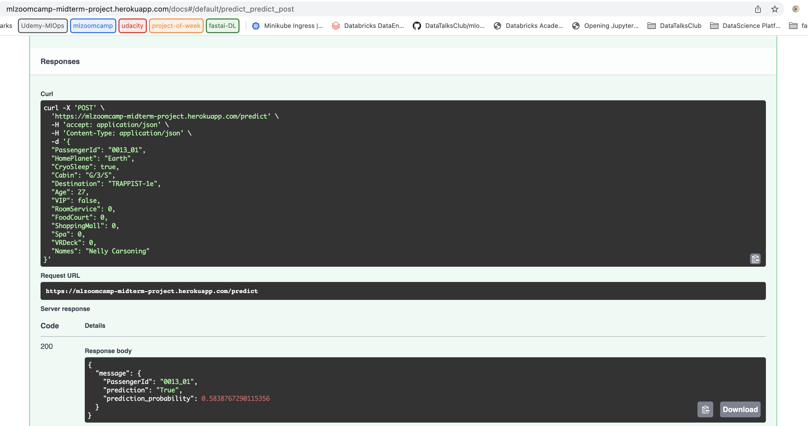

## Midterm Project - Spaceship Titanic

In this project we are building and API for predicting whether a passenger was transported to an alternate dimension during the Spaceship Titanic's collision with the spacetime anomaly. To help you make these predictions, you're given a set of personal records recovered from the ship's damaged computer system.

###### Prediction API : https://mlzoomcamp-midterm-project.herokuapp.com/

###### Curl example:

```bash
curl -X 'POST' \
  'https://mlzoomcamp-midterm-project.herokuapp.com/predict' \
  -H 'accept: application/json' \
  -H 'Content-Type: application/json' \
  -d '{
  "PassengerId": "0013_01",
  "HomePlanet": "Earth",
  "CryoSleep": true,
  "Cabin": "G/3/S",
  "Destination": "TRAPPIST-1e",
  "Age": 27,
  "VIP": false,
  "RoomService": 0,
  "FoodCourt": 0,
  "ShoppingMall": 0,
  "Spa": 0,
  "VRDeck": 0,
  "Names": "Nelly Carsoning"
}'
```


### Data

Data is available in the `data` folder. The `train.csv` file contains the training set.

Dataset reference: `https://www.kaggle.com/competitions/spaceship-titanic/data`

**Note**: In order to download data from kaggle, you need to create an account on kaggle.com and download the `kaggle.json` file from your account. Then, you need to put this file in the `~/.kaggle` folder. Then execute the `ml/download_data.py` script to download the data under the `data` folder.


#### Run with Docker

You can run the project with Docker. To do so, you need to have Docker installed on your machine. Then, you need to build the image with the following command:

```bash
docker build -t mlzoomcamp-midterm-2022 .
```

Then, you can run the project with the following command:

```bash
docker run -it -p 8000:8000 mlzoomcamp-midterm-2022:latest
```


### COMMANDS
#### 1. Create pipenv environment
```bash
pipenv install
```

#### 2. Activate pipenv environment
```bash
pipenv shell
{get the virtual environment name}
```

#### 3. Add pipenv environment to jupyter notebook
```bash
python -m ipykernel install --user --name={virtual environment name}
```

#### 4. Run jupyter notebook
```bash
jupyter notebook
```

#### 5. Train model Script
```bash
pipenv run python train_script.py
```

#### 5. Trained Random Forest model and XGBoost model. In order to test the prediction, you need to run the main.py file with the following command:
```bash
pipenv run python -m uvicorn main:app
```

#### 6. Test from the browser



